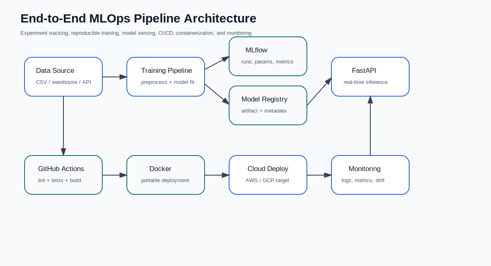
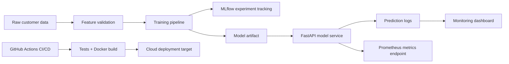
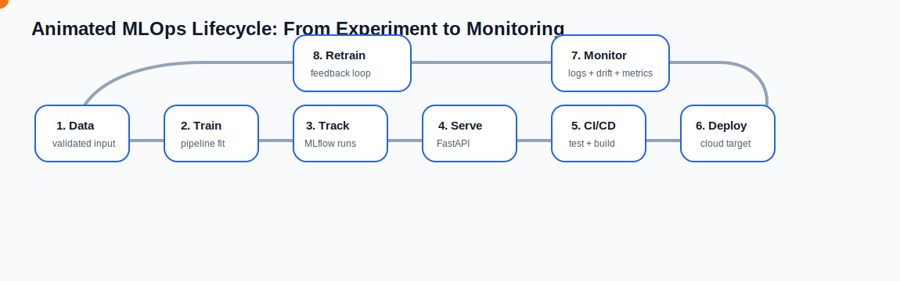
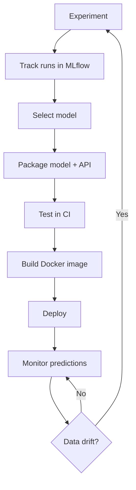

# End-to-End MLOps Pipeline


A production-style MLOps project that takes a customer churn model from experimentation to deployment readiness. The system includes reproducible model training, MLflow experiment tracking, FastAPI model serving, Docker containerization, GitHub Actions CI/CD, prediction logging, lightweight monitoring, and cloud deployment templates.

> **Portfolio positioning:** This project demonstrates that a model is not finished after training. It must be versioned, tested, containerized, served, monitored, and continuously improved.

---


## Executive Summary

This repository wraps a churn prediction model with a full MLOps workflow. It uses customer account behavior to predict churn risk and exposes the model through a production-ready API. The system also tracks experiments, stores model metadata, logs inference events, exposes Prometheus-compatible metrics, and includes CI/CD automation for testing and Docker image validation.

### Business Value

Customer churn prediction is valuable only when business teams can use the model reliably. This project converts a machine learning model into an operational service that can be integrated into CRM, retention dashboards, and automated customer-success workflows.

### Resume Line

**Designed an end-to-end MLOps pipeline with Docker containerization, CI/CD via GitHub Actions, and MLflow experiment tracking for reproducible deployment.**

---

## Key Features

| Capability | Description |
|---|---|
| Reproducible training | Trains a churn model using a scikit-learn pipeline with fixed random seeds. |
| MLflow tracking | Logs parameters, metrics, and model artifacts for experiment comparison. |
| Model registry layer | Stores model artifact and metadata separately for version-aware serving. |
| FastAPI serving | Provides `/predict`, `/batch-predict`, `/model-info`, `/health`, and `/metrics`. |
| Docker support | Builds a portable API image that can run locally or in the cloud. |
| GitHub Actions CI/CD | Runs linting, model training, unit tests, and Docker build validation. |
| Monitoring hooks | Logs inference events and exposes Prometheus-compatible API metrics. |
| Drift utilities | Includes Population Stability Index logic for numeric feature drift checks. |
| Cloud-ready templates | Includes GCP Cloud Run script, AWS ECS notes, and Kubernetes manifest. |

---

## Tech Stack

| Layer | Tools |
|---|---|
| Language | Python |
| Model | Scikit-learn Random Forest / Logistic Regression |
| Experiment tracking | MLflow |
| API | FastAPI, Pydantic, Uvicorn |
| Monitoring | Prediction logs, PSI drift utility, Prometheus metrics endpoint |
| Containerization | Docker, Docker Compose |
| CI/CD | GitHub Actions |
| Dashboard | Streamlit, Plotly |
| Deployment targets | AWS ECS, GCP Cloud Run, Kubernetes-ready manifest |
| Testing | Pytest, FastAPI TestClient |

---

## System Architecture





---

## Animated MLOps Algorithm

The animated diagram below shows the project lifecycle. The moving orange point represents a model artifact or feedback signal moving across the MLOps system.



### Step-by-Step Algorithm Explanation

| Step | Stage | What Happens | Why It Matters |
|---|---|---|---|
| 1 | Data ingestion | Load customer data from CSV or synthetic fallback. | Ensures the pipeline can run locally and in CI. |
| 2 | Feature validation | Check required columns and prepare numeric/categorical features. | Prevents bad production payloads from silently breaking inference. |
| 3 | Training | Fit a scikit-learn pipeline with preprocessing and classification. | Keeps training and inference transformations consistent. |
| 4 | Experiment tracking | Log parameters, metrics, and model artifact to MLflow. | Enables reproducibility and model comparison. |
| 5 | Model packaging | Save model artifact and metadata to the model registry layer. | Separates training from serving. |
| 6 | API serving | Load the model into FastAPI and serve predictions. | Makes the model usable by real applications. |
| 7 | CI/CD | Run linting, tests, training smoke check, and Docker build. | Reduces deployment risk. |
| 8 | Monitoring | Log inference events and expose service metrics. | Helps detect model decay, usage changes, and operational issues. |
| 9 | Retraining loop | Use monitoring feedback to trigger future experiments. | Keeps the model aligned with new customer behavior. |



---

## Repository Structure

```text
end-to-end-mlops-pipeline/
│
├── api/
│   ├── main.py                  # FastAPI application
│   └── schemas.py               # Pydantic request/response schemas
│
├── app/
│   └── streamlit_app.py         # Optional monitoring/demo dashboard
│
├── src/
│   ├── config.py                # Central paths and settings
│   ├── data.py                  # Data loading and validation
│   ├── features.py              # Preprocessing graph
│   ├── modeling.py              # Model pipeline builder
│   ├── train.py                 # Training + MLflow tracking
│   ├── evaluate.py              # Model metrics and threshold selection
│   ├── model_registry.py        # Artifact and metadata management
│   ├── predict.py               # Batch and single prediction logic
│   └── monitoring.py            # Logging, risk bands, PSI drift utility
│
├── data/
│   ├── raw/sample_churn.csv
│   └── examples/batch_prediction_sample.csv
│
├── models/                      # Generated model artifacts
├── monitoring/                  # Generated prediction logs
├── reports/                     # Generated reports
├── assets/                      # Diagrams and animations
├── notebooks/                   # Experiment notebook
├── tests/                       # Unit and API tests
├── scripts/                     # Training and deployment helper scripts
├── k8s/                         # Kubernetes deployment manifest
│
├── Dockerfile
├── docker-compose.yml
├── Makefile
├── requirements.txt
├── pyproject.toml
└── README.md
```

---

## Dataset

This project includes a lightweight synthetic customer churn dataset at:

```text
data/raw/sample_churn.csv
```

The dataset includes fields commonly used in telecom/SaaS churn modeling:

| Feature | Meaning |
|---|---|
| `tenure_months` | How long the customer has stayed |
| `monthly_charges` | Current monthly payment |
| `total_charges` | Lifetime customer charges |
| `contract_type` | Month-to-month, one year, or two year |
| `internet_service` | DSL, fiber optic, or no internet service |
| `payment_method` | Billing/payment method |
| `support_calls_last_90d` | Recent support friction signal |
| `late_payments_last_12m` | Payment-risk signal |
| `churn` | Target label: 1 = churned, 0 = retained |

You can replace the sample dataset with a real churn dataset as long as the same feature columns are available.

---

## Quick Start

### 1. Clone the repository

```bash
git clone https://github.com/YOUR-USERNAME/end-to-end-mlops-pipeline.git
cd end-to-end-mlops-pipeline
```

### 2. Create virtual environment

Windows:

```bash
python -m venv venv
venv\Scriptsctivate
```

Mac/Linux:

```bash
python -m venv venv
source venv/bin/activate
```

### 3. Install dependencies

```bash
pip install -r requirements.txt
```

### 4. Train the model

```bash
python -m src.train --data-path data/raw/sample_churn.csv --model-path models/churn_pipeline.joblib
```

### 5. Run the API

```bash
uvicorn api.main:app --reload
```

Open the API docs:

```text
http://127.0.0.1:8000/docs
```

---

## API Usage

### Health Check

```bash
curl http://127.0.0.1:8000/health
```

### Single Prediction

```bash
curl -X POST "http://127.0.0.1:8000/predict"   -H "Content-Type: application/json"   -d '{
    "tenure_months": 6,
    "monthly_charges": 95.0,
    "total_charges": 570.0,
    "contract_type": "Month-to-month",
    "internet_service": "Fiber optic",
    "payment_method": "Electronic check",
    "support_calls_last_90d": 4,
    "late_payments_last_12m": 2
  }'
```

Expected response:

```json
{
  "churn_probability": 0.73,
  "churn_prediction": 1,
  "risk_band": "High",
  "recommended_action": "Prioritize retention call, discount review, and service-quality investigation.",
  "features_used": [
    "tenure_months",
    "monthly_charges",
    "total_charges",
    "support_calls_last_90d",
    "late_payments_last_12m",
    "contract_type",
    "internet_service",
    "payment_method"
  ]
}
```

### Batch Prediction

```bash
curl -X POST "http://127.0.0.1:8000/batch-predict"   -F "file=@data/examples/batch_prediction_sample.csv"   -o predictions.csv
```

### Prometheus Metrics

```text
http://127.0.0.1:8000/metrics
```

---

## MLflow Experiment Tracking

Run MLflow locally:

```bash
mlflow ui --host 0.0.0.0 --port 5000
```

Then train again:

```bash
python -m src.train --data-path data/raw/sample_churn.csv
```

Open:

```text
http://localhost:5000
```

Tracked items:

| Item | Logged |
|---|---|
| Model type | ✅ |
| Training rows | ✅ |
| Number of features | ✅ |
| Accuracy | ✅ |
| Precision | ✅ |
| Recall | ✅ |
| F1 score | ✅ |
| ROC AUC | ✅ |
| Model artifact | ✅ |

---

## Docker Usage

Build image:

```bash
docker build -t mlops-churn-api:latest .
```

Run container:

```bash
docker run --rm -p 8000:8000 mlops-churn-api:latest
```

Or use Docker Compose with API + MLflow:

```bash
docker compose up --build
```

Services:

| Service | URL |
|---|---|
| FastAPI API | `http://localhost:8000` |
| API docs | `http://localhost:8000/docs` |
| MLflow UI | `http://localhost:5000` |

---

## CI/CD Workflow

GitHub Actions workflow is available at:

```text
.github/workflows/ci-cd.yml
```

The workflow performs:

1. Repository checkout
2. Python setup
3. Dependency installation
4. Ruff lint check
5. Model training smoke test
6. Pytest suite
7. Docker image build
8. Cloud deployment placeholder

This is intentionally designed as a safe CI/CD pattern for a student-to-production portfolio project.

---

## Monitoring and Drift

### Prediction Logging

Every `/predict` request is logged as JSONL:

```text
monitoring/prediction_logs.jsonl
```

Each event contains:

| Field | Description |
|---|---|
| `timestamp_utc` | Inference timestamp |
| `payload` | Input features |
| `prediction` | Probability, label, risk band, and recommendation |

### Drift Detection

The project includes a Population Stability Index utility:

```python
from src.monitoring import drift_report

report = drift_report(reference_df, current_df)
```

Interpretation guide:

| PSI Value | Interpretation |
|---|---|
| `< 0.10` | No meaningful drift |
| `0.10 - 0.25` | Moderate drift; monitor closely |
| `> 0.25` | Significant drift; consider retraining |

---

## Streamlit Monitoring Dashboard

Run:

```bash
streamlit run app/streamlit_app.py
```

Dashboard includes:

| View | Purpose |
|---|---|
| Model metadata | See trained model type, metrics, threshold, and features |
| Single prediction | Simulate customer churn prediction |
| Batch prediction | Upload CSV and download prediction output |
| Monitoring logs | Review recent inference events |

---

## Testing

Run all tests:

```bash
pytest -q
```

Expected output:

```text
8 passed
```

Test coverage includes:

| Test Area | Covered |
|---|---|
| Synthetic data generation | ✅ |
| Model pipeline fit/predict | ✅ |
| Risk-band logic | ✅ |
| Retention recommendation logic | ✅ |
| PSI drift utility | ✅ |
| FastAPI health endpoint | ✅ |
| FastAPI prediction endpoint | ✅ |

---

## Cloud Deployment Options

### Option 1: GCP Cloud Run

Use:

```bash
bash scripts/cloud_run_deploy.sh
```

Before running, update:

```text
PROJECT_ID="your-gcp-project-id"
REGION="asia-south1"
```

### Option 2: AWS ECS

See:

```text
scripts/aws_ecs_notes.md
```

### Option 3: Kubernetes

Use the manifest:

```bash
kubectl apply -f k8s/deployment.yaml
```

---

## Business Interpretation Layer

The model does not only output a binary class. It converts probability into business-friendly retention actions.

| Risk Band | Probability Range | Business Action |
|---|---:|---|
| Low | `< 35%` | Maintain standard engagement |
| Medium | `35% - 65%` | Send targeted retention offer |
| High | `> 65%` | Prioritize retention call and service review |

This makes the output understandable for non-technical stakeholders.

---

## Model Governance Notes

A production ML system should include clear governance boundaries:

| Governance Area | Implementation in This Project |
|---|---|
| Reproducibility | Fixed random seed and model metadata |
| Traceability | MLflow run ID and saved model metadata |
| Reliability | API tests and CI workflow |
| Portability | Dockerfile and Docker Compose |
| Observability | Prediction logs and `/metrics` endpoint |
| Maintainability | Modular codebase and clear folder separation |

---

## Limitations

This project is production-style but intentionally lightweight for portfolio use.

| Limitation | Future Production Upgrade |
|---|---|
| Uses local file-based model registry | Use MLflow Model Registry, S3, GCS, or artifact store |
| Uses JSONL prediction logs | Stream logs to database, Kafka, or cloud logging |
| Uses synthetic sample data | Replace with real telecom/SaaS customer data |
| Basic drift logic | Add scheduled drift reports and alerting |
| Deployment scripts are templates | Connect to real cloud accounts and secrets manager |

---

## Future Enhancements

- Add Evidently AI reports for automated drift dashboards.
- Add model approval workflow before deployment.
- Add canary deployment pattern.
- Add batch inference scheduler.
- Add database-backed feature store.
- Add authentication for API endpoints.
- Add Grafana dashboard for Prometheus metrics.
- Add retraining trigger when PSI exceeds threshold.

---

## Resume Bullets

- Designed an end-to-end MLOps pipeline with FastAPI, Docker, GitHub Actions, and MLflow experiment tracking for reproducible customer churn deployment.
- Implemented model serving endpoints for single and batch predictions with business-friendly churn risk segmentation and retention recommendations.
- Added CI/CD automation to validate model training, run unit tests, lint source code, and build Docker images before deployment.
- Built lightweight monitoring with prediction logging, Prometheus-compatible metrics, and Population Stability Index drift utilities.

---

## LinkedIn Post Caption

I built an end-to-end MLOps pipeline that takes a customer churn model beyond notebook experimentation and turns it into a deployment-ready ML service.

The project includes:

- Reproducible model training
- MLflow experiment tracking
- FastAPI prediction service
- Docker containerization
- GitHub Actions CI/CD
- Prediction logging and monitoring hooks
- Drift detection utility using PSI
- Cloud deployment templates for AWS/GCP

This project helped me understand how machine learning models are managed, served, monitored, and improved in real-world production environments.

---

## Author Details

**Author:** Darshan Paapani  
**Role Focus:** AIML Engineer | Data Scientist | ML Engineer  
**Project Category:** Advanced MLOps / Production Machine Learning  
**Portfolio Goal:** Demonstrate production-readiness beyond model training, including deployment, CI/CD, tracking, and monitoring.
